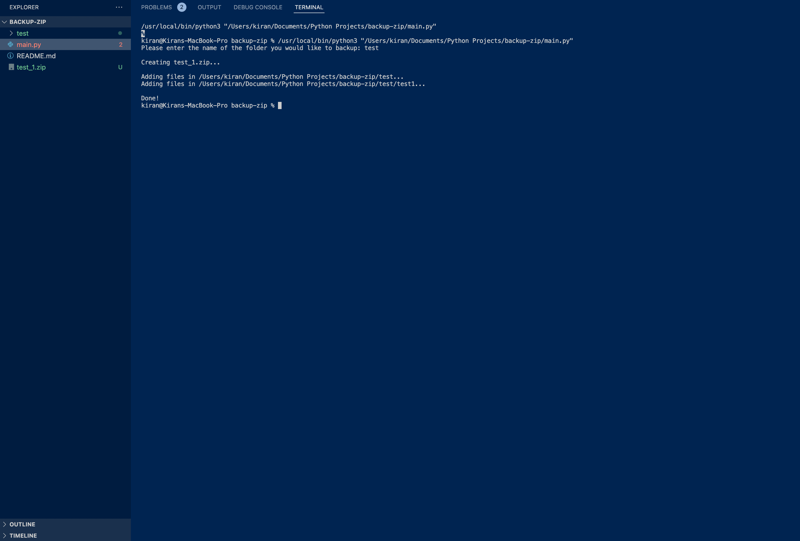

# backup-zip
> Backs up a foler as a .zip file.

## Table of Contents
* [General Info](#general-information)
* [Technologies Used](#technologies-used)
* [Screenshots](#screenshots)
* [Setup](#setup)
* [Usage](#usage)
* [Project Status](#project-status)
* [Acknowledgements](#acknowledgements)
* [Contact](#contact)

## General Information
This program allows the user to create a backup of a folder as a .zip file.

## Technologies Used
- Python 3
- zipfile
- os

## Screenshots

## Setup
Ensure zipfile and os has been installed.

## Usage
Begin by enterring the full name of the folder you would like to backup, and then ensure the .zip has been created. 

## Project Status
Project is: _complete_

## Acknowledgements
Give credit here.
- This project was inspired by the Writing to Files section in Automate the Boring Stuff with Python: Practical Programming for Total Beginners by Al Sweigart.

## Contact
Created by [@KiranSmelser](https://github.com/KiranSmelser) - please feel free to reach out and contact me!